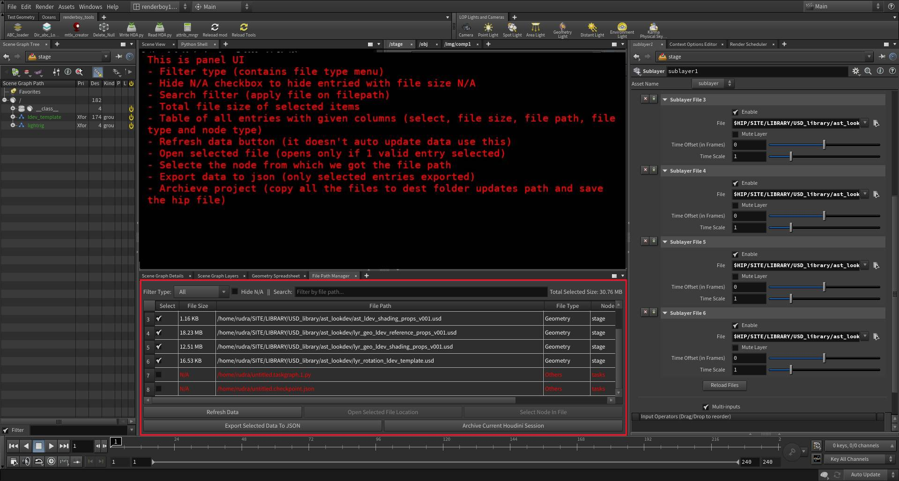
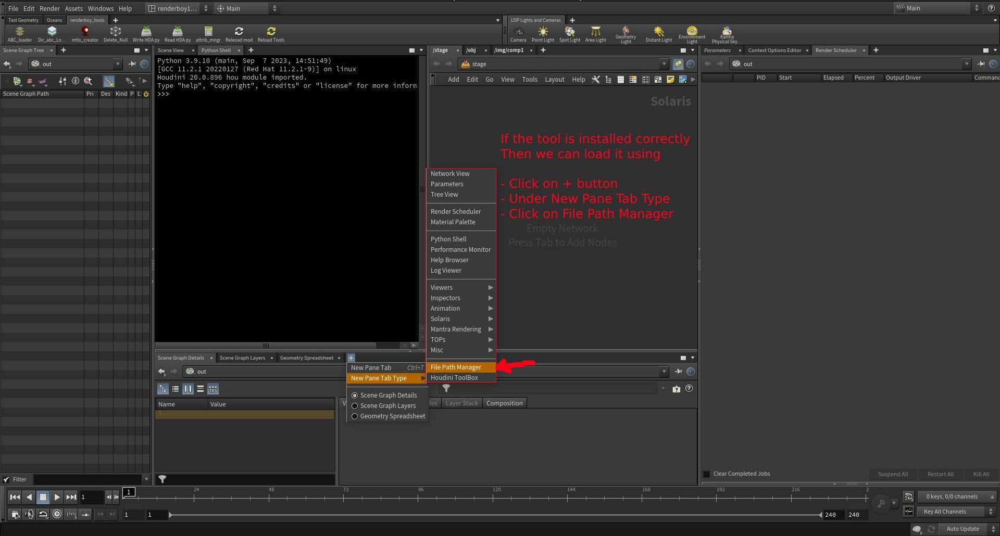

A powerful and extensible **file path auditing and management tool** for Houdini artists and technical directors. 
This tool helps you organize, verify, and archive all external file references in a Houdini project with ease.

---

## ✨ Key Features

- 🔍 File Path Discovery
  - Automatically scans and lists all file paths across the current Houdini session.
  - Detects paths in SOPs, LOPs, CHOPs, OBJs, ROPs, and other contexts.
  - Identifies whether a file path is a **single frame** or a **sequence** using expression analysis (`$F`, `$F4`, etc.).
- 📂 Open File Location
  - Instantly open the folder containing any file with a single click.
- 🧭 Select Node in Houdini
  - Automatically select and focus on the node that owns the file path.
- 🗂 Export Selected Paths
  - Export selected file path data to a clean `.json` file with full metadata.
- 📦 Archive Houdini Project
  - Copy all selected external files to a new structured folder.
  - Organizes by file type (`Geometry`, `Texture`, `Volume`, etc.).
  - Automatically relinks file paths in Houdini to the archived location.
  - Saves a new `.hip` file with updated paths.
- 🔎 Advanced Filtering
  - Filter by file type (Geometry, Texture, Volume, etc.)
  - Search paths using text input
  - Show/hide paths with missing files (`N/A`)
- 💾 Detailed File Metadata
  - Shows **individual file sizes**
  - Displays **total size** of all selected files
  - Highlights missing or unreadable files in red
  - Includes source context (e.g., `SOP`, `ROP`, `LOP`, etc.)

---

## 📸 Screenshots / Video links

**Video Demonstration**

---

## 📦 Installation

1. Houdini Packages Setup
  - Replace DIR_PATH key-value `path/to/source/folder` with current path of this repo in explorer inside `HFilePathManager_tool.json` file.
  - Copy the `HFilePathManager_tool.json` package file inside the same houdini's `packages/` directory.:
    - On Windows:  
     `C:/Users/<YourName>/Documents/houdiniXX.X/packages/`
    - On Linux:
     `/home/<YourName>/houdiniXX.X/packages/`
2. Launch the Tool
  - Launch Houdini
  - Go to `Windows` → `Python Panel`
  - Click on `File Path Manager`
  - If all goes well it will show you the panel.

---

## 🔐 Licensing

This tool is commercially licensed:

| License Type         | Access        | Duration | Notes                         |
|----------------------|---------------|----------|-------------------------------|
| 🔓 Full License      | Source Code   | Lifetime | One-time purchase             |
| 🔐 Encrypted License | Encrypted UI  | 1 Year   | Requires renewal to continue  |

Contact for pricing or enterprise licensing:  
📧 **codesutrahub@gmail.com**

---

## 🧠 Internals (for License Holders)

- PySide2-based UI using Houdini’s Python API
- File references collected using recursive `hou.node("/")` traversal
- Path rewriting is done with `hou.Parm.set()`
- Supports encrypted deployment using PyArmor or Cython
- Modular code structure with clean separation of UI and logic

---

## 🙋 Contact & Demo Access

Interested in testing the tool or viewing source?  
📧 Reach out to: **codesutrahub@gmail.com**

---

## 🧾 License Summary

This repository is a **private portfolio preview**.  
Use, redistribution, and modification are prohibited without a valid commercial license.
